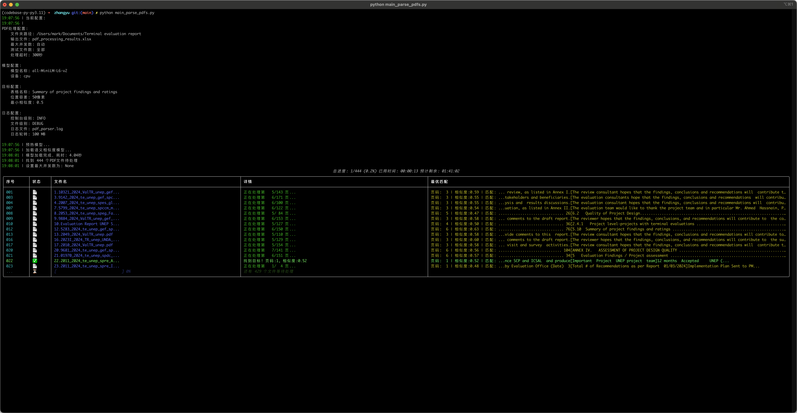
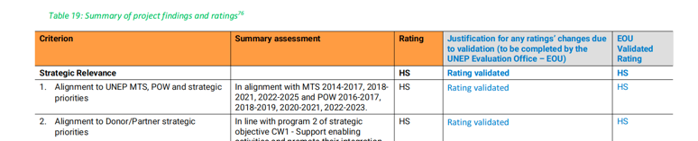
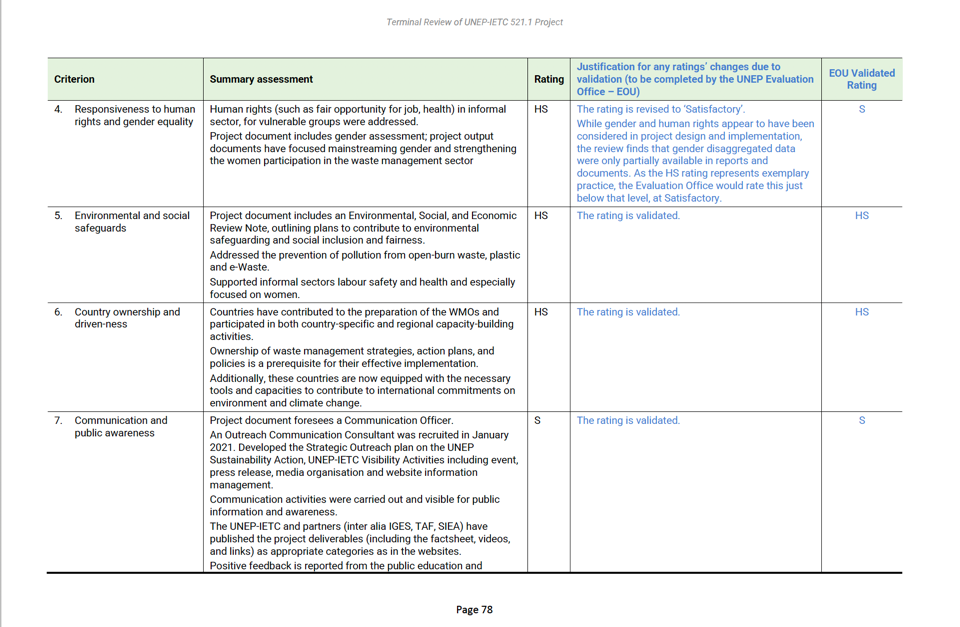
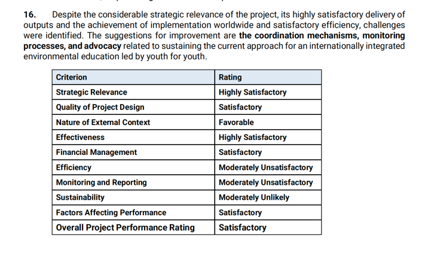

# Sentiment based PDF Parser

## Demo



## Tips

### 字体颜色是不可靠谱的

14:18:53 | [6 / 444] parsing file:///Users/mark/Documents/Terminal%20evaluation%20report/9.9884_2024_ValTR_unep_gef_msp.pdf
14:19:04 | found table at page(71-78)



## Bad Cases

### 诡异重复 【优先解决】

#### bugs

14:19:26 | [10 / 444] parsing file:///Users/mark/Documents/Terminal%20evaluation%20report/16.2023I_2024_TR_unep_UNDA_Cycling%20Policies.pdf
14:19:32 | [DUPLICATE], last table at page(92-93), current page at 94


14:19:32 | [11 / 444] parsing file:///Users/mark/Documents/Terminal%20evaluation%20report/17.2010_2024_ValTR_unep.pdf
14:19:39 | [DUPLICATE], last table at page(74-77), current page at 78


#### 原因

把含 col.. 的空列去掉就行了。

```
2024-11-15 15:08:09 | DEBUG |   page 92
2024-11-15 15:08:09 | DEBUG |   found table in page(92), header_names:
['Criterion', 'Col1', 'Col2', 'Summary Assessment', 'Rating', 'Col5', 'Col6']
2024-11-15 15:08:09 | DEBUG |   page 93
2024-11-15 15:08:09 | DEBUG |   found table in page(93), header_names:
['Criterion', 'Col1', 'Col2', 'Summary Assessment', 'Rating', 'Col5', 'Col6']
2024-11-15 15:08:09 | DEBUG |   page 94
2024-11-15 15:08:09 | DEBUG |   found table in page(94), header_names:
['Criterion', 'Col1', 'Col2', 'Summary Assessment', 'Col4', 'Rating', 'Col6', 'Col7']
2024-11-15 15:08:09 | WARNING | [DUPLICATE], last table at page(92-93), current page at 94
```

### 定义表导致重复

```
Criterion Rating
Strategic Relevance Highly Satisfactory
Quality of Project Design Satisfactory
Nature of External Context Favorable
Effectiveness Highly Satisfactory
Financial Management Satisfactory
Efficiency Moderately Unsatisfactory
Monitoring and Reporting Moderately Unsatisfactory
Sustainability Moderately Unlikely
Factors Affecting Performance Satisfactory
Overall Project Performance Rating Satisfactory
```

14:06:22 | [3 / 444] parsing file:
///Users/mark/Documents/Terminal%20evaluation%20report/4.2007_2024_te_unep_spes_global_Enironment%20education%20Youth.pdf
14:06:26 | [DUPLICATE], last table at page(13-13), current page at 56


14:19:12 | [8 / 444] parsing file:///Users/mark/Documents/Terminal%20evaluation%20report/12.5283_2024_te_unep_gef_sphpe_speg_Africa_LMO%20Testing.pdf
14:19:18 | [DUPLICATE], last table at page(15-15), current page at 79


