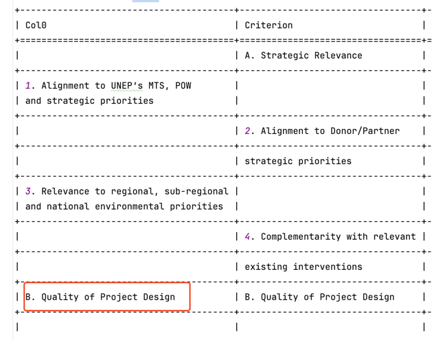
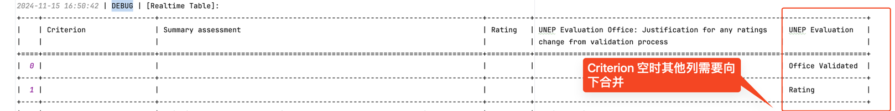
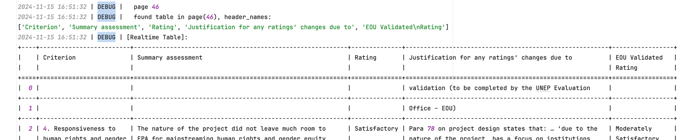
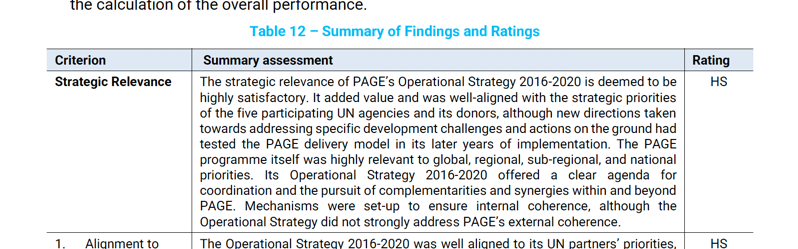

# Sentiment based PDF Parser

## Demo


## Tips

### 字体颜色是不可靠的

14:18:53 | [6 / 444] parsing file:///Users/mark/Documents/Terminal%20evaluation%20report/9.9884_2024_ValTR_unep_gef_msp.pdf
14:19:04 | found table at page(71-78)


### 表头是不可靠的


## Bad Cases

### [Solved] 诡异重复

#### bugs

14:19:26 | [10 / 444] parsing file:///Users/mark/Documents/Terminal%20evaluation%20report/16.2023I_2024_TR_unep_UNDA_Cycling%20Policies.pdf
14:19:32 | [DUPLICATE], last table at page(92-93), current page at 94


14:19:32 | [11 / 444] parsing file:///Users/mark/Documents/Terminal%20evaluation%20report/17.2010_2024_ValTR_unep.pdf
14:19:39 | [DUPLICATE], last table at page(74-77), current page at 78


#### 解决方案

把含 col.. 的空列去掉就行了。

```
2024-11-15 15:08:09 | DEBUG |   page 92
2024-11-15 15:08:09 | DEBUG |   found table in page(92), header_names:
['Criterion', 'Col1', 'Col2', 'Summary Assessment', 'Rating', 'Col5', 'Col6']
2024-11-15 15:08:09 | DEBUG |   page 93
2024-11-15 15:08:09 | DEBUG |   found table in page(93), header_names:
['Criterion', 'Col1', 'Col2', 'Summary Assessment', 'Rating', 'Col5', 'Col6']
2024-11-15 15:08:09 | DEBUG |   page 94
2024-11-15 15:08:09 | DEBUG |   found table in page(94), header_names:
['Criterion', 'Col1', 'Col2', 'Summary Assessment', 'Col4', 'Rating', 'Col6', 'Col7']
2024-11-15 15:08:09 | WARNING | [DUPLICATE], last table at page(92-93), current page at 94
```

但是竟然还有单元格重复的……



### 定义表误匹配

> 一般只有一级指标，以及两列，但也有三列的（122#10 加 ref.)等

```
Criterion Rating
Strategic Relevance Highly Satisfactory
Quality of Project Design Satisfactory
Nature of External Context Favorable
Effectiveness Highly Satisfactory
Financial Management Satisfactory
Efficiency Moderately Unsatisfactory
Monitoring and Reporting Moderately Unsatisfactory
Sustainability Moderately Unlikely
Factors Affecting Performance Satisfactory
Overall Project Performance Rating Satisfactory
```

14:06:22 | [3 / 444] parsing file:
///Users/mark/Documents/Terminal%20evaluation%20report/4.2007_2024_te_unep_spes_global_Enironment%20education%20Youth.pdf
14:06:26 | [DUPLICATE], last table at page(13-13), current page at 56


14:19:12 | [8 / 444] parsing file:///Users/mark/Documents/Terminal%20evaluation%20report/12.5283_2024_te_unep_gef_sphpe_speg_Africa_LMO%20Testing.pdf
14:19:18 | [DUPLICATE], last table at page(15-15), current page at 79


### 列需要向下合并

> 这种一般是紧接着出错，即 56-59，然后 60 出错，但是不能直接连接，因为会有脏行
> 解决办法有二：
> 1. 【暴力】按照 顺序或者 sentiment 进行列对齐，然后删除 criterion 为空的行
> 2. 【推荐】先合并列，以\n合并编码，再对齐

16:50:37 | [44 / 444] parsing file:///Users/mark/Documents/Terminal%20evaluation%20report/57.01607_02088_2023_ValTR_unep_TTVC.pdf
16:50:42 | [DUPLICATE], last table at page(61-68), current page at 69


16:51:27 | [71 / 444] parsing file:///Users/mark/Documents/Terminal%20evaluation%20report/90.9820_2023_ValTR_unep_gef_msp_CBIT%20Ghana.pdf
16:51:32 | [DUPLICATE], last table at page(42-45), current page at 46


### 表格和表名连在了一起

17:06:41 | [89 / 444] parsing file:///Users/mark/Documents/Terminal%20evaluation%20report/117.PIMS%20Id%2001659%2002032_2023_Partnership_for%20Action_On_Green_Economy%20_PAGE_Op%20Strategy.pdf
17:06:49 | [DUPLICATE], last table at page(16-16), current page at 83
