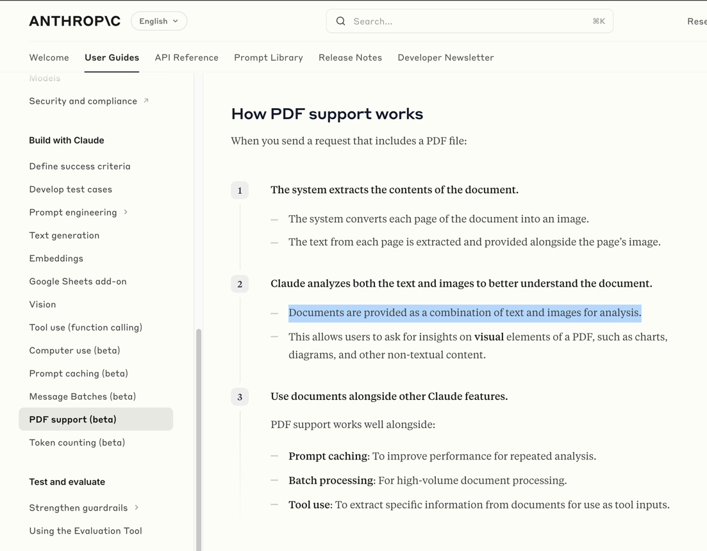
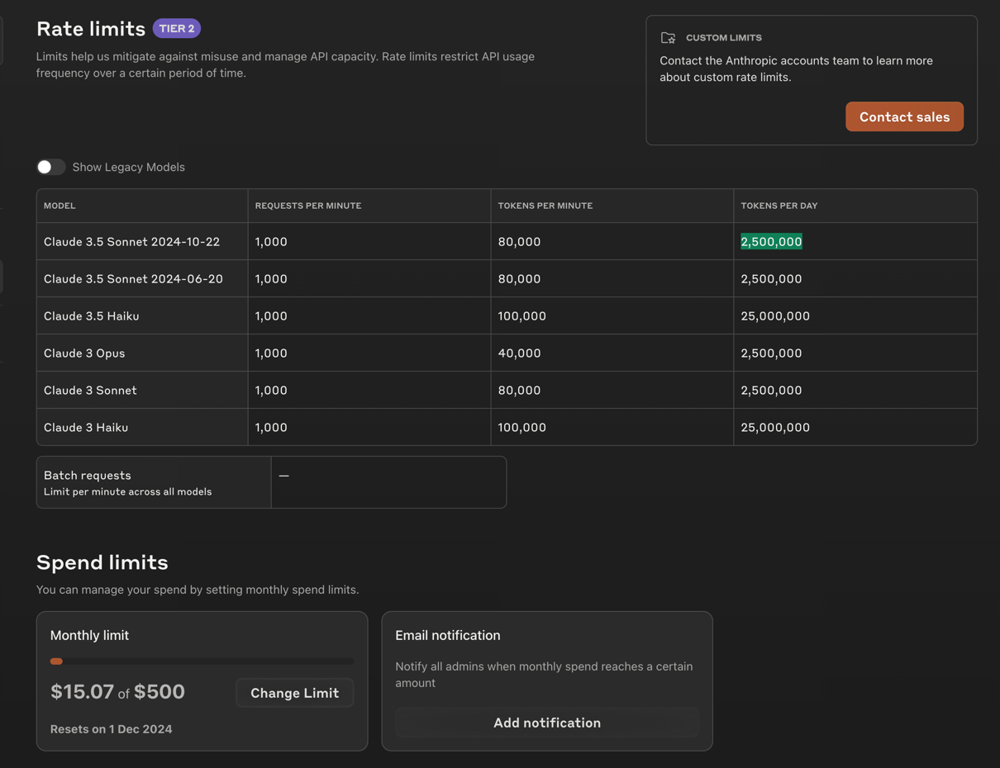
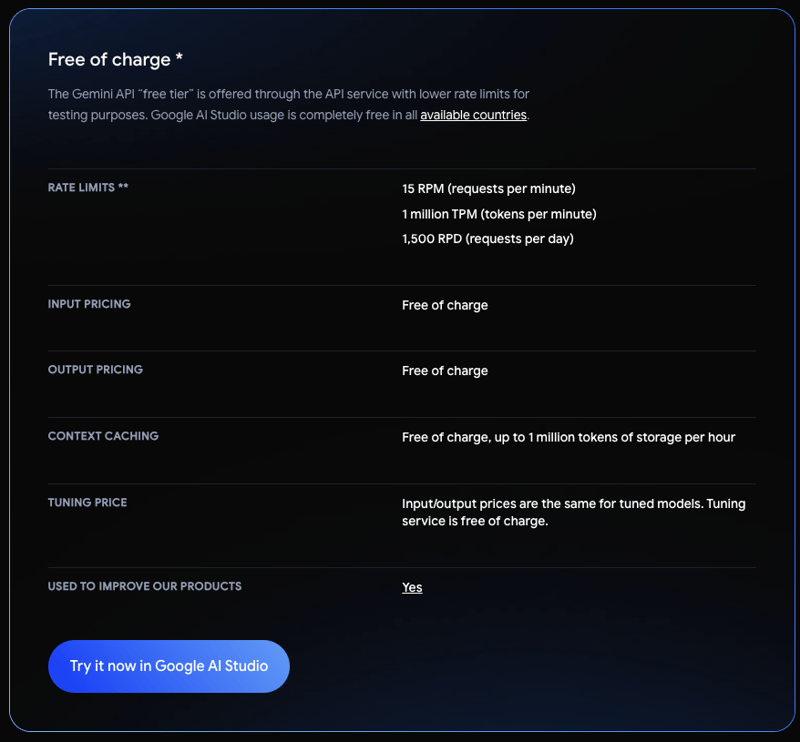

# V2

## 强烈推荐：Claude

claude 的 pdf 理解能力非常强（T0），是图文混合多模态，非常推荐优先尝试。

但它的 API 端限制较大，并发不满足大规模需求。

前端逆向的 API 或许可以尝试一下，因为可以传的文件更多，rate-limit 也稍微宽松一些，或者找专门的号池。

## 推荐：Gemini

Gemini 的效果也让还行（T1），直来直去的问题貌似回复很好，但稍微复杂点的感觉幻觉很严重，具体还要测试。

最大的优点是免费力度特别大，Google 就是财大气粗！

## 保留意见：所有国产模型
