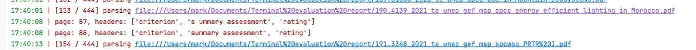
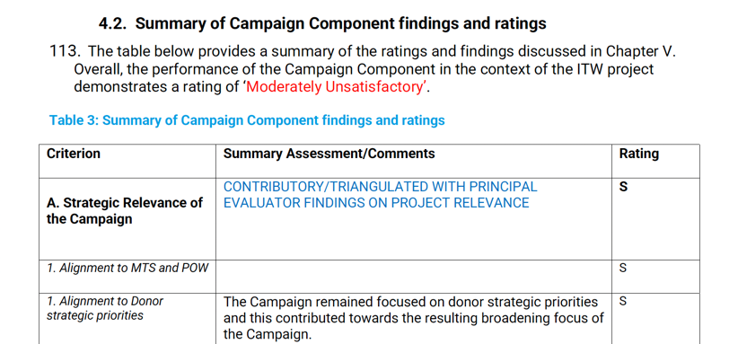

# Sentiment based PDF Parser

## Usage

### 初始化项目

```shell
# 在根目录
export PYTHONPATH=$(pwd)
poetry shell
poetry install
cd src/v3_stable
```

### 初始化数据：一步步来即可

```shell
# init
python step_1_pages_from_local.py

# table relative
python step_2_add_candidate_tables.py
python step_3_merge_tables.py
python step_4_dump_tables.py
python step_5_pivot_table.py

# date relative
python step_6_update_publish_month.py
python step_7_dump_stat_sheet.py
```

### 更新表结构后 （models)

```shell
alembic revision --autogenerate -m {MESSAGE}
alembic upgrade head
```

## Tips

### 字体颜色是不可靠的

14:18:53 | [6 / 444] parsing file:///Users/mark/Documents/Terminal%20evaluation%20report/9.9884_2024_ValTR_unep_gef_msp.pdf
14:19:04 | found table at page(71-78)


### 表头是不可靠的


## Bad Cases

### [Solved] 诡异重复

#### bugs

14:19:26 | [10 / 444] parsing file:///Users/mark/Documents/Terminal%20evaluation%20report/16.2023I_2024_TR_unep_UNDA_Cycling%20Policies.pdf
14:19:32 | [DUPLICATE], last table at page(92-93), current page at 94


14:19:32 | [11 / 444] parsing file:///Users/mark/Documents/Terminal%20evaluation%20report/17.2010_2024_ValTR_unep.pdf
14:19:39 | [DUPLICATE], last table at page(74-77), current page at 78


#### 解决方案

把含 col.. 的空列去掉就行了。

```
2024-11-15 15:08:09 | DEBUG |   page 92
2024-11-15 15:08:09 | DEBUG |   found table in page(92), header_names:
['Criterion', 'Col1', 'Col2', 'Summary Assessment', 'Rating', 'Col5', 'Col6']
2024-11-15 15:08:09 | DEBUG |   page 93
2024-11-15 15:08:09 | DEBUG |   found table in page(93), header_names:
['Criterion', 'Col1', 'Col2', 'Summary Assessment', 'Rating', 'Col5', 'Col6']
2024-11-15 15:08:09 | DEBUG |   page 94
2024-11-15 15:08:09 | DEBUG |   found table in page(94), header_names:
['Criterion', 'Col1', 'Col2', 'Summary Assessment', 'Col4', 'Rating', 'Col6', 'Col7']
2024-11-15 15:08:09 | WARNING | [DUPLICATE], last table at page(92-93), current page at 94
```

但是竟然还有单元格重复的……


### 定义表误匹配

> 一般只有一级指标，以及两列，但也有三列的（122#10 加 ref.)等

```
Criterion Rating
Strategic Relevance Highly Satisfactory
Quality of Project Design Satisfactory
Nature of External Context Favorable
Effectiveness Highly Satisfactory
Financial Management Satisfactory
Efficiency Moderately Unsatisfactory
Monitoring and Reporting Moderately Unsatisfactory
Sustainability Moderately Unlikely
Factors Affecting Performance Satisfactory
Overall Project Performance Rating Satisfactory
```

14:06:22 | [3 / 444] parsing file:
///Users/mark/Documents/Terminal%20evaluation%20report/4.2007_2024_te_unep_spes_global_Enironment%20education%20Youth.pdf
14:06:26 | [DUPLICATE], last table at page(13-13), current page at 56


14:19:12 | [8 / 444] parsing file:///Users/mark/Documents/Terminal%20evaluation%20report/12.5283_2024_te_unep_gef_sphpe_speg_Africa_LMO%20Testing.pdf
14:19:18 | [DUPLICATE], last table at page(15-15), current page at 79


### 列在视觉上 ok，但解析出来有问题

17:40:01 | [153 / 444] parsing file:///Users/mark/Documents/Terminal%20evaluation%20report/190.4139_2021_te_unep_gef_msp_spcc_energy_efficient_lighting_in_Morocco.pdf
17:40:08 | page: 87, headers: ['criterion', 's ummary assessment', 'rating']
17:40:08 | page: 88, headers: ['criterion', 'summary assessment', 'rating']


### 列需要向下合并

> 这种一般是紧接着出错，即 56-59，然后 60 出错，但是不能直接连接，因为会有脏行
> 解决办法有二：
> 1. 【暴力】按照 顺序或者 sentiment 进行列对齐，然后删除 criterion 为空的行
> 2. 【推荐】先合并列，以\n合并编码，再对齐

16:50:37 | [44 / 444] parsing file:///Users/mark/Documents/Terminal%20evaluation%20report/57.01607_02088_2023_ValTR_unep_TTVC.pdf
16:50:42 | [DUPLICATE], last table at page(61-68), current page at 69


16:51:27 | [71 / 444] parsing file:///Users/mark/Documents/Terminal%20evaluation%20report/90.9820_2023_ValTR_unep_gef_msp_CBIT%20Ghana.pdf
16:51:32 | [DUPLICATE], last table at page(42-45), current page at 46


### 表格和表名连在了一起

17:06:41 | [89 / 444] parsing file:///Users/mark/Documents/Terminal%20evaluation%20report/117.PIMS%20Id%2001659%2002032_2023_Partnership_for%20Action_On_Green_Economy%20_PAGE_Op%20Strategy.pdf
17:06:49 | [DUPLICATE], last table at page(16-16), current page at 83


17:35:29 | [129 / 444] parsing file:///Users/mark/Documents/Terminal%20evaluation%20report/165.4934_2022_te_unep_gef_fsp_spcc_Global_EbA-South.pdf
2024-11-15 17:35:29 | DEBUG |   page 15
2024-11-15 17:35:30 | DEBUG | headers: ['key findings']
2024-11-15 17:35:30 | DEBUG |   page 16
2024-11-15 17:35:30 | INFO | page: 16, headers: ['criterion', 'summary assessment', 'rating']
2024-11-15 17:35:30 | DEBUG |   page 17
2024-11-15 17:35:30 | INFO | page: 17, headers: ['criterion', 'summary assessment', 'rating']
2024-11-15 17:35:30 | DEBUG |   page 18
2024-11-15 17:35:30 | INFO | page: 18, headers: ['criterion', 'summary assessment', 'rating']

### 表格重复

17:29:47 | [125 / 444] parsing file:///Users/mark/Documents/Terminal%20evaluation%20report/161.1215_5319_5615_unep_undp_gef_capacity_for_ldc_negotiators.pdf
17:29:48 | page: 10, headers: ['criterion', 'summary assessment', 'rating']
17:29:48 | page: 11, headers: ['criterion', 'summary assessment', 'rating']
17:29:48 | page: 12, headers: ['criterion', 'summary assessment', 'rating']
17:29:48 | page: 13, headers: ['criterion', 'summary assessment', 'rating']
17:29:51 | page: 64, headers: ['criterion', 'summary assessment', 'rating']
17:29:52 | page: 65, headers: ['criterion', 'summary assessment', 'rating']
17:29:52 | page: 66, headers: ['criterion', 'summary assessment', 'rating']
17:29:52 | page: 67, headers: ['criterion', 'summary assessment', 'rating']

### 两种不同目的的表格

17:36:58 | [136 / 444] parsing file:///Users/mark/Documents/Terminal%20evaluation%20report/173.01951_2021_te_unep_speg_Global_Illicit%20Trade%20in%20Wildlife.pdf
17:37:01 | page: 73, headers: ['criterion', 'summary assessment', 'rating']
17:37:02 | page: 74, headers: ['criterion', 'summary assessment', 'rating']
17:37:02 | page: 75, headers: ['criterion', 'summary assessment', 'rating']
17:37:02 | page: 76, headers: ['criterion', 'summary assessment', 'rating']
17:37:02 | page: 77, headers: ['criterion', 'summary assessment', 'rating']
17:37:05 | page: 117, headers: ['criterion', 'summary assessment/comments', 'rating']
17:37:05 | page: 118, headers: ['criterion', 'summary assessment/comments', 'rating']
17:37:05 | page: 119, headers: ['criterion', 'summary assessment/comments', 'rating']
17:37:05 | page: 120, headers: ['criterion', 'summary assessment/comments', 'rating']




### 表头不跨页（仅一页的一般也是有问题的）

17:42:13 | [162 / 444] parsing file:///Users/mark/Documents/Terminal%20evaluation%20report/199.4930_2020_te_unep-gef_global_bd_seagrass_eocystems_of_dugongs_Indian_and%20pacific%20oceans.pdf
17:42:17 | page: 76, headers: ['criterion', 'summary assessment', 'rating']
17:42:17 | page: 77, headers: ['criterion', 'summary assessment', 'rating']
17:42:17 | page: 78, headers: ['criterion', 'summary assessment', 'rating']
17:42:17 | page: 79, headers: ['criterion', 'summary assessment', 'rating']
17:42:19 | page: 99, headers: ['criterion', 'summary assessment', 'rating']
17:42:19 | page: 100, headers: ['criterion', 'summary assessment', 'rating']
17:42:19 | page: 101, headers: ['criterion', 'summary assessment', 'rating']
17:42:21 | page: 122, headers: ['criterion', 'summary assessment', 'rating'] <--
17:42:22 | page: 146, headers: ['criterion', 'summary assessment', 'rating']
17:42:23 | page: 167, headers: ['criterion', 'summary assessment', 'rating']
17:42:23 | page: 168, headers: ['criterion', 'summary assessment', 'rating']
17:42:23 | page: 169, headers: ['criterion', 'summary assessment', 'rating']
17:42:23 | page: 170, headers: ['criterion', 'summary assessment', 'rating']

17:43:36 | [167 / 444] parsing file:///Users/mark/Documents/Terminal%20evaluation%20report/204.4512_2020_te_spcc_fsp_asia_pacific_climate_technology_network_and_finance_centre_ctnfc.pdf
17:43:37 | page: 14, headers: ['criterion', 'rating']
17:43:38 | page: 15, headers: ['criterion', 'rating']
17:43:49 | page: 70, headers: ['criterion', 'summary assessment of the findings', 'rating']

### 多张表（不同区域的）

17:59:57 | [253 / 444] parsing file:///Users/mark/Documents/Terminal%20evaluation%20report/285.00609-1866_2017_te_unvironment_global_spcc_eba_mountain.pdf
17:59:58 | page: 19, headers: ['criterion', 'overall rating']
18:00:04 | page: 79, headers: ['criterion', 'summary assessment', 'ref.', 'rating']
18:00:08 | page: 123, headers: ['criterion', 'summary assessment', 'ref.', 'rating']
18:00:09 | page: 124, headers: ['criterion', 'summary assessment', 'ref.', 'rating']
18:00:09 | page: 125, headers: ['criterion', 'summary assessment', 'ref.', 'rating']
18:00:09 | page: 126, headers: ['criterion', 'summary assessment', 'ref.', 'rating']
18:00:09 | page: 127, headers: ['criterion', 'summary assessment', 'ref.', 'rating']
18:00:09 | page: 128, headers: ['criterion', 'summary assessment', 'ref.', 'rating']
18:00:10 | page: 129, headers: ['criterion', 'summary assessment', 'ref.', 'rating']
18:00:10 | page: 130, headers: ['criterion', 'summary assessment', 'ref.', 'rating']
18:00:10 | page: 131, headers: ['criterion', 'summary assessment', 'ref.', 'rating']
18:00:10 | page: 132, headers: ['criterion', 'summary assessment', 'ref.', 'rating']
18:00:10 | page: 133, headers: ['criterion', 'summary assessment', 'ref.', 'rating']
18:00:11 | page: 134, headers: ['criterion', 'summary assessment', 'ref.', 'rating']
18:00:11 | page: 135, headers: ['criterion', 'summary assessment', 'ref.', 'rating']


## Notes

### Step 5

输入表格的列为 Criterion Rating SummaryAssessment FileName

其中 Criterion 列里的值大致如下：
```
Strategic Relevance
"1. Alignment to UNEPMTS, POW and strategicpriorities"
"2. Alignment to Donor/Partner strategic priorities"
"3. Relevance to global, regional, sub-regional and national environmental priorities"
"4. Complementarity with relevant existing interventions/coherence"
Quality of Project Design
Nature of External Context
Effectiveness
1. Availability of outputs
"2. Achievement of project outcomes"
3. Likelihood of impact
Financial Management
"1. Adherence to UNEP’s financial policies and procedures"
"2. Completeness of project financial information"
"3. Communication between finance and project management staff"
Efficiency
Monitoring and Reporting
"1. Monitoring design and budgeting"
"2. Monitoring of project implementation"
3. Project reporting
Sustainability
"1. Socio-political sustainability"
2. Financial sustainability
"3. Institutional sustainability"
"Factors Affecting Performance"
"1. Preparation and readiness"
"2. Quality of project management and supervision"
"2.1 UNEP/Implementing Agency:"
"2.2 Partners/Executing Agency:"
"3. Stakeholders’ participation and cooperation"
"4. Responsiveness to human rights and gender equality"
"5. Environmental and social safeguards"
"6. Country ownership and driven-ness"
"7. Communication and public awareness"
"Overall Project Performance Rating"
```

这些值里分一级（不带标号）、二级（带标号），但这只是某一份表格里的格式，其他表格可能不会有序号，或者会用英文字符标记等，而且二级指标是不可信赖的

因此，我的想法是，我们基于这些固定的一级指标，进行相似度匹配，以进行分类

接着，把原先的一列拆成两列（L1、L2），从上往下，L1 向前顺填，L2 的第一行则为空

最后把pivot 的表保存成 原文件名_pivot.xlsx